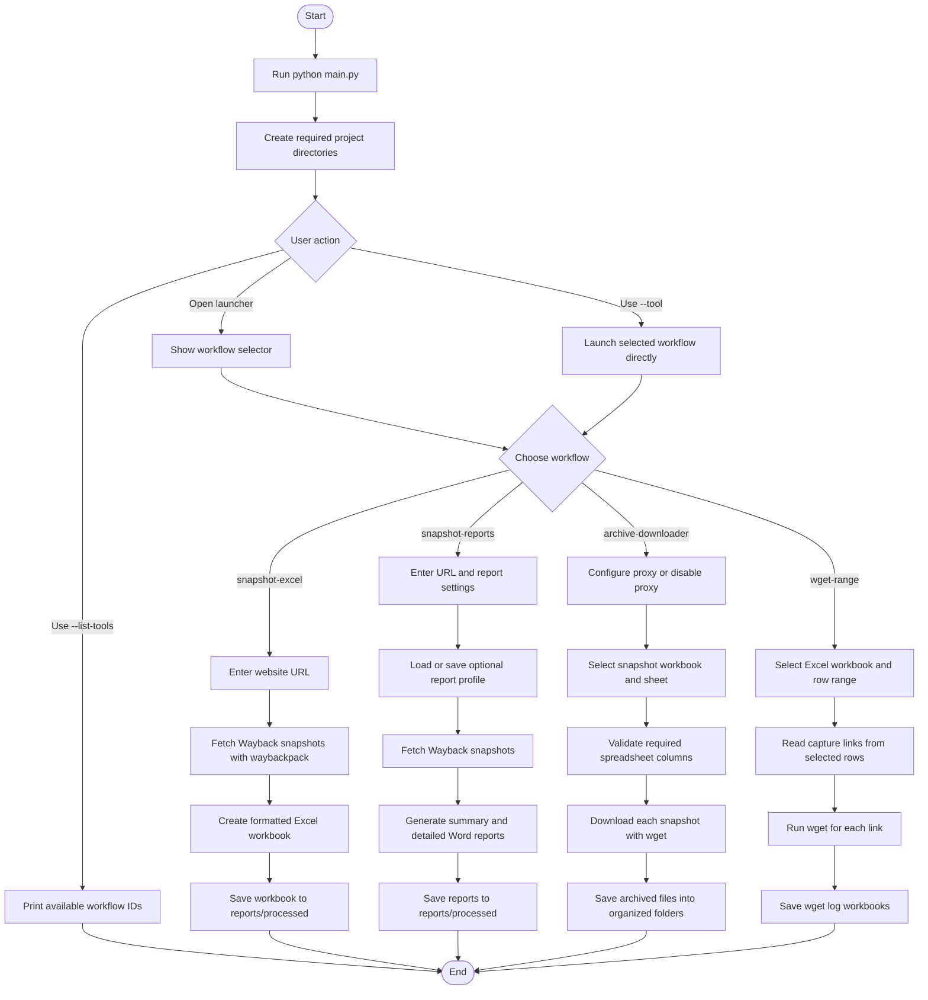

# Broken Link Recovery Tool


A Python desktop tool for recovering broken-link context by exporting, reporting on, and downloading Wayback Machine website snapshots.

## Project Description

Broken Link Recovery Tool helps organize web-archive recovery and broken-link analysis workflows. The application uses a single launcher, `main.py`, to open several Tkinter-based desktop tools for working with Wayback Machine captures.

The toolkit can:

- Fetch historical snapshot URLs for a website through `waybackpack`.
- Export snapshots into formatted Excel workbooks.
- Generate Word summary and detailed analysis reports.
- Download archived website content from snapshot spreadsheets with `wget`.
- Save reusable snapshot-report profiles and proxy profiles as JSON.
- Keep older script names available through lightweight wrappers in `scripts/`.

Generated spreadsheets, reports, downloaded files, logos, and profile data are organized under `reports/`, `profiles/`, and download output folders.

## Installation

1. Clone or download the project.

```bash
git clone <repository-url>
cd neverbroken
```

2. Create and activate a virtual environment.

Windows PowerShell:

```powershell
python -m venv .venv
.\.venv\Scripts\Activate.ps1
```

macOS or Linux:

```bash
python -m venv .venv
source .venv/bin/activate
```

3. Install Python dependencies.

```bash
pip install -r requirements.txt
```

Required Python packages:

- `pandas`
- `openpyxl`
- `python-docx`
- `Pillow`
- `waybackpack`

4. Confirm external tooling is available.

The application uses:

- `waybackpack` to list Wayback Machine captures.
- `wget` to download archived website files.

This repository includes `wget.exe` at the project root for Windows users. The downloader first looks for `wget` on your system `PATH`, then falls back to the bundled executable.

## Usage

Start the main launcher:

```bash
python main.py
```

List available workflow IDs:

```bash
python main.py --list-tools
```

Open a specific workflow directly:

```bash
python main.py --tool snapshot-excel
python main.py --tool snapshot-reports
python main.py --tool archive-downloader
python main.py --tool wget-range
```

Available workflows:

- `snapshot-excel`: Fetch Wayback Machine captures for a URL and save a formatted workbook to `reports/processed/<domain>_snapshots.xlsx`.
- `snapshot-reports`: Generate Word summary and detailed analysis reports in `reports/processed/`.
- `archive-downloader`: Read a snapshot spreadsheet, optionally apply proxy settings, and download archived website files.
- `wget-range`: Download capture links from a selected Excel row range and write wget logs.

Legacy wrappers are still available in `scripts/`, but new usage should go through `main.py`.

## Program Flow



## Project Structure

```text
main.py                         Single application entry point
requirements.txt                Python dependencies
wget.exe                        Bundled Windows wget executable
modules/
  launcher.py                   CLI routing and workflow launcher
  paths.py                      Shared project paths and directory setup
  wayback.py                    Wayback URL, domain, snapshot, and date helpers
  excel_reports.py              Excel workbook generation and formatting
  document_reports.py           Word report generation
  downloads.py                  wget checks, downloads, and logging
  proxy.py                      Proxy environment helpers
  profiles.py                   JSON profile persistence
  gui_*.py                      Tkinter workflow windows
scripts/                        Legacy wrappers around the modular workflows
profiles/                       Saved report and proxy profiles
reports/                        Generated reports, spreadsheets, and assets
```

## Tests

There is not a dedicated automated test suite in the repository yet. Use these smoke checks after changes:

Compile all Python files:

```bash
python -m compileall -q main.py modules scripts
```

Verify the launcher can discover workflows:

```bash
python -B main.py --list-tools
```

After installing dependencies, verify imports:

```bash
python -B -c "import modules.gui_snapshot_exporter, modules.gui_report_generator, modules.gui_archive_downloader, modules.gui_wget_range; print('imports ok')"
```

## Statement of AI Use

I use generative AI to accelerate my coding, but strictly maintain a "human in the loop" to ensure accountability and accuracy. Because AI is not a substitute for foundational programming knowledge and can produce confident errors (hallucinations), I actively apply my expertise to debug and refine all automated suggestions.

I am also highly vigilant against AI bias, recognizing that machine learning models can easily absorb and amplify historical inequalities. To build fair applications, I critically evaluate my algorithms and avoid flawed proxies—*using an easily measurable but misleading metric to represent a complex reality, much like using a person's zip code to judge their financial reliability*. By recognizing these limitations, I ensure incomplete data does not unfairly penalize vulnerable groups. Ultimately, the responsibility for the code rests entirely with me.

## License

This project is licensed under the MIT License.

## References

"This README was structured based on the principles outlined in How to Write a Good README File for Your GitHub Project (https://www.freecodecamp.org/news/how-to-write-a-good-readme-file/) by freeCodeCamp."

"The code comments were written using the methodology described in AI Programming with Python - Module Name: Commenting in Python (https://www.udacity.com/course/ai-programming-python-nanodegree--nd089) by Udacity."

"The Statement of AI Use was informed by the University of Maryland Robert H. Smith School of Business resource Free Online Certificate: Artificial Intelligence and Career Empowerment (https://www.rhsmith.umd.edu/programs/executive-education/learning-opportunities-individuals/free-online-certificate-artificial-intelligence-and-career-empowerment)."

**Best Practices Citation:** [Indentations with Python](https://learn.udacity.com/nd089?version=13.0.8&partKey=cd13568&lessonKey=58044931-0630-4b80-9feb-3586c32e53d7&conceptKey=5386d06d-51e7-4dfa-a407-bbdb7bb42a45)
